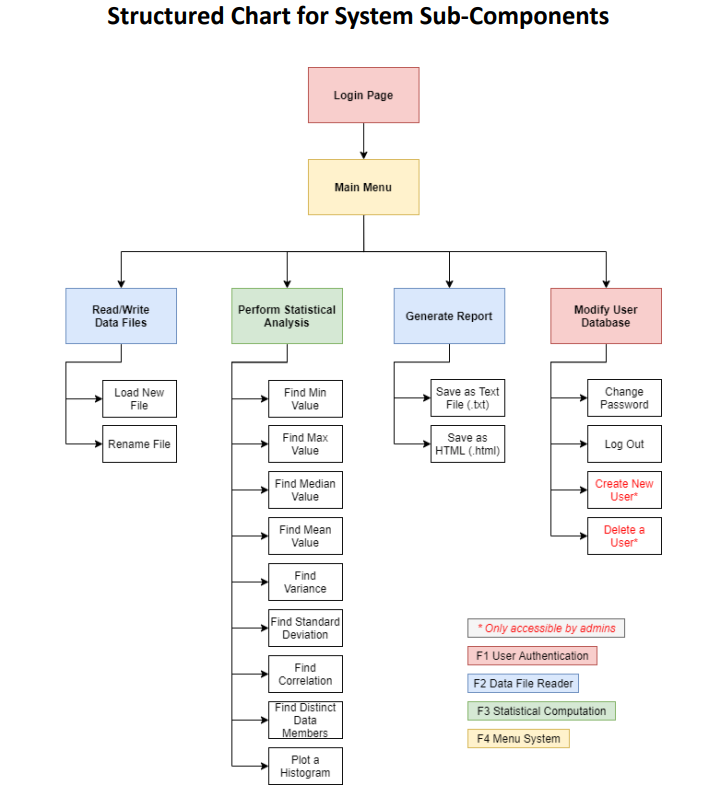
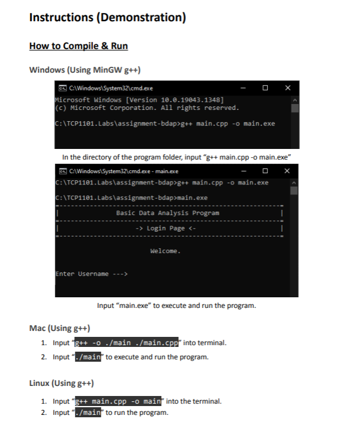
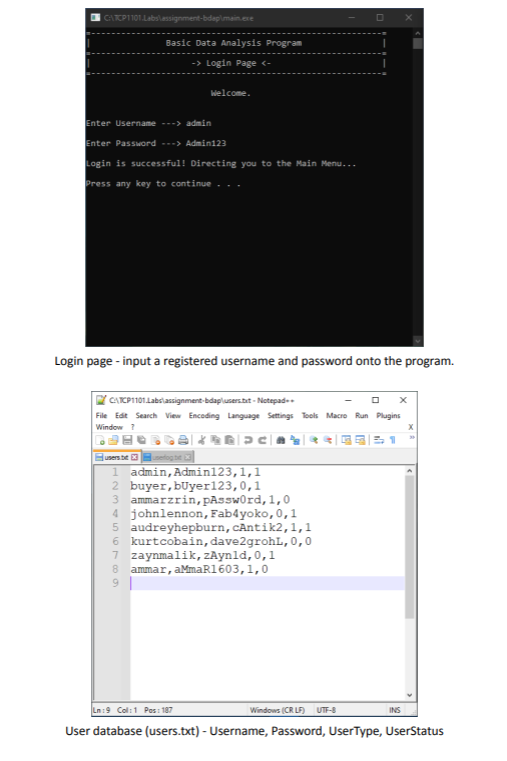
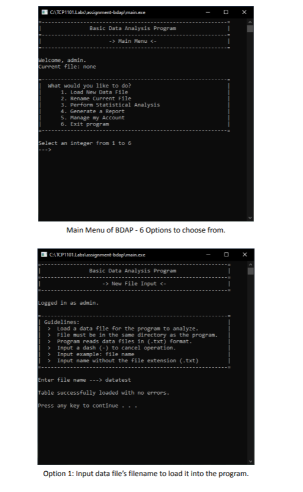
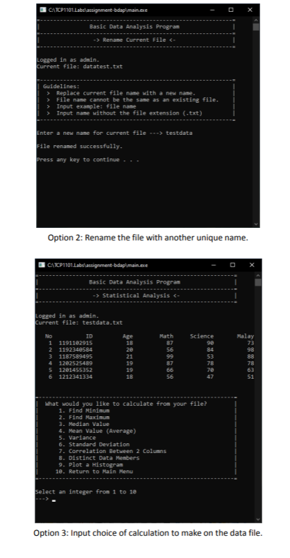
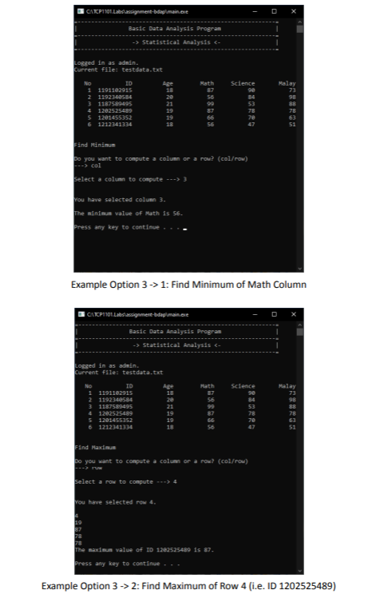

# Assignment-BDAP
We were tasked to create a software that: automatically analyzes a data file provided by the
user, is able to perform calculations, and generate reports within the program, exported
both as text and HTML files. 

## Objective
Users are prompted to enter a filename to be uploaded into the
program. This software would also keep a log file tracking the users’ operations performed
from login until the user exits. The program will also have a database file to store a list of all
users.

## System Sub-Component Chart
  <tr>
    <td></td>
  </tr>

## User Manual
- ### How To Run:
  <tr>
    <td></td>
  </tr>
        
## Screenshots
<table>
  <tr>
    <td></td>
    <td></td>
  </tr>
  <tr>
    <td></td>
    <td></td>
  </tr>

